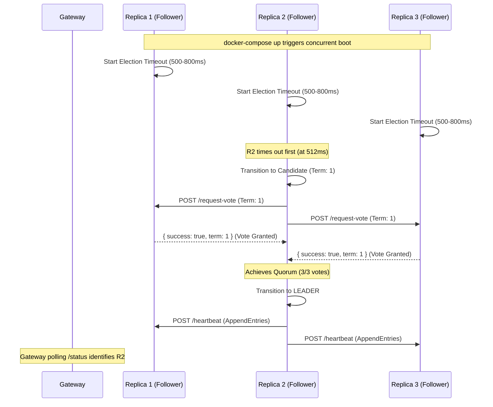
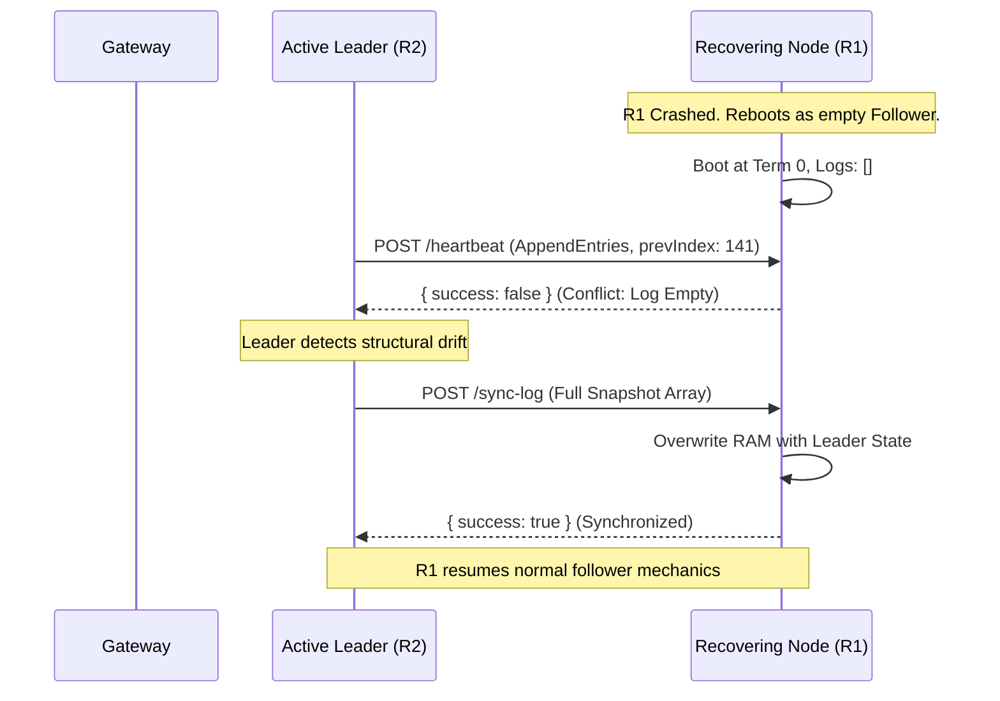
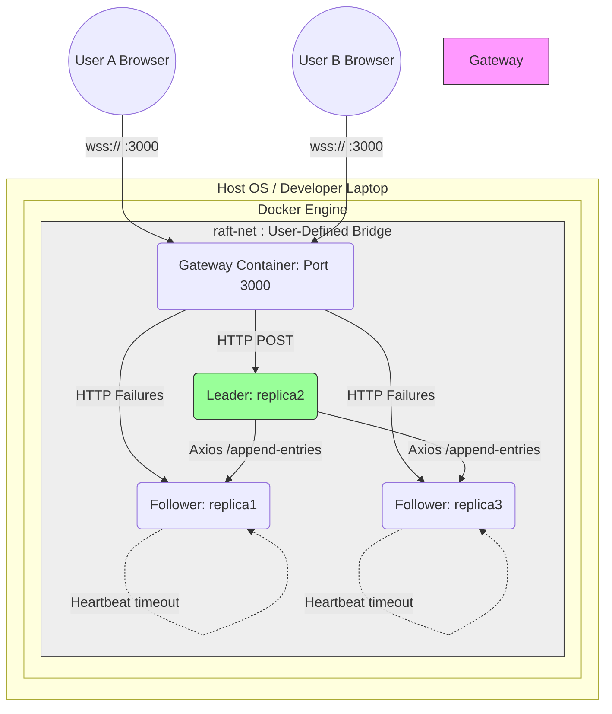
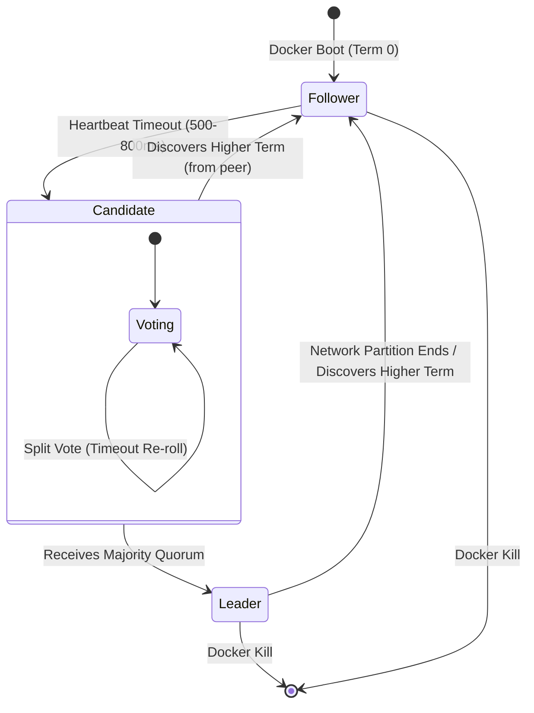
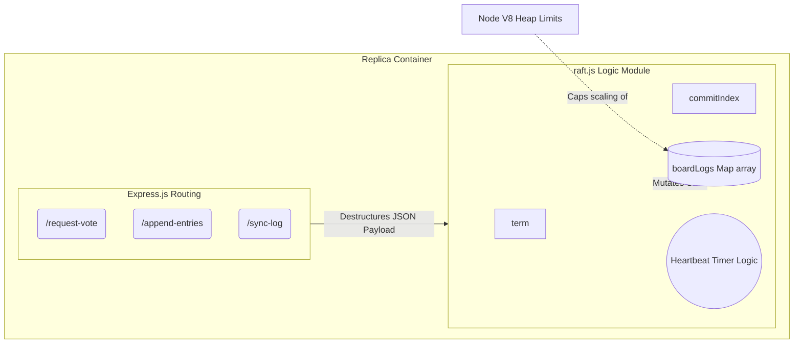

# Documentation Audit & Architecture Guide

## Objective

Create a comprehensive architecture and implementation document by auditing the complete codebase. The document should explain not only **what** the system does, but also **how** and **why** each component works. It should follow the implementation flow from high-level architecture down to individual subsystems.

---

# Architecture & Implementation Document

## 1. Introduction
### 1.1 Project Overview
The Mini-RAFT Drawing Board is a distributed, real-time collaborative drawing application built upon the principles of the RAFT consensus algorithm. It allows multiple clients to connect through a centralized Gateway via WebSockets and collaboratively interact with a shared drawing canvas. The underlying state of the drawing board (a sequence of drawing strokes) is maintained by a cluster of replica nodes that communicate using the RAFT protocol to achieve strong consistency, fault tolerance, and high availability.

### 1.2 Purpose
The primary purpose of this project is to serve as an educational implementation and functional demonstration of distributed systems engineering. By integrating a complex backend consensus algorithm (RAFT) with a visual, real-time frontend application, it bridges the gap between theoretical distributed systems concepts and practical web development. It demonstrates how to handle leader election, log replication, and failover mechanisms seamlessly while maintaining a responsive user experience. 

### 1.3 Key Features
- **Real-Time Collaboration**: Multiple users can draw on the canvas simultaneously, seeing each other's strokes in real-time.
- **RAFT Consensus Implementation**: A fully functional, custom-built Node.js implementation of the RAFT protocol handling leader election, term management, and strict log matching.
- **High Availability & Fault Tolerance**: The system is designed to survive node failures. If the leader node crashes, the remaining follower nodes automatically initiate a new election to establish a new leader without human intervention.
- **WebSocket Gateway Routing**: A centralized gateway transparently handles WebSocket connections from web clients and routes drawing actions to the current RAFT leader.
- **Dockerized Architecture**: The entire application (frontend, gateway, and replicas) is containerized using Docker and orchestrated with Docker Compose, ensuring consistent deployment and isolated networking via internal bridges.

### 1.4 Technology Stack
- **Frontend / Client UI**: 
  - Vanilla HTML5, CSS3, and JavaScript.
  - Deployed using `http-server` acting as a static file server within a Node.js Alpine container.
- **Gateway Service**: 
  - Node.js running an Express HTTP API and a `ws` (WebSocket) server.
  - `axios` for HTTP REST communication with the backend replicas.
- **Replica Nodes (RAFT Cluster)**: 
  - Node.js and Express for HTTP-based inter-node RPC communication.
  - `nodemon` utilized in development for hot-bounded reloads.
- **Infrastructure**: 
  - Docker Desktop / Engine (v24+) and Docker Compose (v2+).
  - Internal Docker Bridge networking (`raft-net`) isolates intra-cluster and gateway communication from the host environment.

### 1.5 Repository Structure
The repository is explicitly decoupled into independent microservices, facilitating modular development and individual scaling:
- **`/frontend`**: Contains the client-facing UI logic (`index.html`, `style.css`, `app.js`) and its respective `Dockerfile`.
- **`/gateway`**: Houses the gateway application (`server.js`, `leaderTracker.js`), responsible for proxying WebSocket connections and tracking the current RAFT leader.
- **`/replica1`, `/replica2`, `/replica3`**: Although structurally identical in logic, these are segregated directories representing the persistence nodes in the RAFT cluster. They contain the core RAFT algorithm implementation.
- **`/documentation`**: A central hub for architectural records, software requirement specifications (SRS), and implementation plans.
- **`docker-compose.yml`**: The declarative orchestration file that wires the microservices together, provisions the unified `raft-net` network, and defines container scaling behavior.
- **`README.md`**: Outlines quick-start commands, project architecture at a glance, and common developer workflows.

## 2. System Design & Architecture
### 2.1 High-Level Architecture
The system employs a standard three-tier distributed architecture augmented with WebSocket communication and a Raft-based backend:
- **Client Tier**: Browser-based stateless clients rendering the collaborative canvas.
- **Gateway Tier**: A central WebSocket server that masks the complexity of the backend cluster, scales horizontally for concurrent connections, and manages board rooms (multi-tenancy). 
- **Consensus Tier**: A backend cluster of identical HTTP servers acting as RAFT nodes. These nodes strictly enforce distributed consensus to serialize client operations into an immutable, replicated log.

### 2.2 Architectural Principles
- **Decoupled Frontend**: The frontend holds absolutely no synchronization logic. It renders exact data provided by the Gateway via `full-sync` and applies incremental `stroke-committed` events.
- **Single Source of Truth**: The RAFT cluster Leader is the only entity permitted to append new data to the log. Conflicts are theoretically eliminated by strictly appending via a single leader.
- **Fault Isolation**: If a replica node fails, client WebSocket connections are untouched because they only connect directly to the Gateway.
- **Graceful Degradation**: If the Leader node goes offline, the Gateway does not drop clients. Instead, it queues incoming drawing strokes and broadcasts a `leader-changing` status, delivering the strokes once recovery concludes.

### 2.3 System Components
- **The Browser Client (`app.js`, `index.html`)**: Handles UI rendering and capturing DOM pointer events (mouse/touch), emitting a `stroke` payload over WebSockets.
- **The Gateway (`server.js`)**: Exposes the WebSocket server handling initial connections into specific board rooms based on `join-board` events. It forwards strokes dynamically via an HTTP POST request to wherever the current leader is.
- **The Leader Tracker (`leaderTracker.js`)**: A background worker in the gateway that continuously probes the backend to identify the authoritative Leader. It transparently resolves who holds the highest committed log and the current `Term`.
- **The RAFT Node (`server.js`, `raft.js`)**: An HTTP server exposing standard algorithms of RAFT consensus (`/request-vote`, `/append-entries`, `/heartbeat`). Each node maintains persistent internal state per board mapping (log index, terms, uncommitted and committed strokes).

### 2.4 Request Lifecycle
1. **Connection Initialization**: A client establishes a WS connection to the Gateway and joins a specific board room (e.g., `boardId: "board-public"`).
2. **State Hydration**: The Gateway requests the `/committed-log` from the current Leader and pipes this immediately to the joining client as a `full-sync` payload so they see the current board state.
3. **User Action**: The User draws a stroke on the canvas. The browser packages the vector points and emits a `stroke` WS message.
4. **Proxy Forwarding**: The Gateway identifies the payload and forwards it in an HTTP `POST` to the Leader.
5. **Consensus Achievement**: The Leader appends the stroke to its volatile uncommitted log and issues `append-entries` RPCs to its followers. Upon receiving confirmations from a majority (quorum), the Leader upgrades the stroke to _committed_.
6. **Delivery**: The Leader invokes the Gateway’s `POST /broadcast` webhook. The Gateway relays this exclusively to clients authenticated in that `boardId` room via a `stroke-committed` WS message.

### 2.5 Data Flow
The canonical flow of a single drawing stroke moves strictly in a unidirectional loop:
`Input Event (Browser) -> WebSocket JSON -> Gateway Server -> Axios REST POST -> RAFT Leader (Uncommitted) -> RAFT Followers (Replication) -> RAFT Leader (Committed) -> Axios REST Webhook -> Gateway Server -> WebSocket Broadcast -> Canvas Redraw (Browser)`.

### 2.6 Service Communication
- **Client ↔ Gateway**: Bidirectional WebSocket connection. Payloads contain an explicit `type`, `boardId`, and `data`.
- **Gateway ↔ RAFT Leader**: Traditional synchronous HTTP REST. The Gateway sends commands via POST `/client-stroke` and retrieves data via GET `/committed-log` or GET `/status`.
- **Gateway ← RAFT Leader**: Webhook push notifications. When the Leader commits an entry, it pushes to the Gateway's POST `/broadcast` endpoint to notify the entire client pool.
- **RAFT Node ↔ RAFT Node**: Internal HTTP RPC equivalents for algorithm synchronization (POST `/heartbeat`, POST `/request-vote`, POST `/append-entries`, POST `/sync-log`).

### 2.7 Failure Handling Strategy
The system integrates layered resilience capabilities:
- **Replica Crashes**: Follower notes crash immediately because the Gateway routes to Leader. Quorum ensures durability as long as N/2 + 1 nodes survive. 
- **Leader Crashes**: Remaining followers recognize missing heartbeats, bump their RAFT active term, and initiate a decentralized election process.
- **Client Resilience**: The Gateway's `leaderTracker.js` identifies that target API calls to the Leader are failing. The tracker engages a `failoverActive` state, buffering all new incoming frontend WebSocket strokes in memory. The Gateway issues a WS `leader-changing` payload indicating degraded performance to end-users without disrupting UI state. Once the cluster promotes a new Leader, the backlog is sequentially replayed to the new Leader and `leader-restored` is dispatched.

## 3. Distributed System Architecture
### 3.1 Why Distributed?
A single-server model is a single point of failure (SPOF) and struggles with high state durability when crashes occur. Operating in a distributed cluster enforces high availability—the system remains functional as long as a majority of nodes are operational. It introduces students and practitioners to the complexities of distributed consensus, state machine replication, and cluster observability without enterprise overhead.

### 3.2 Node Responsibilities
Nodes in the RAFT cluster hold equal capability but take on distinct algorithmic responsibilities based on their current state:
- **Leader**: Solely responsible for receiving write requests (drawing strokes) from the Gateway, sequencing them into the log, sending `append-entries` RPCs to followers, committing entries upon majority acknowledgement, and triggering the Gateway broadcast webhook.
- **Follower**: Strictly passive. Responds to `append-entries` (log replication) and `heartbeat` messages from the Leader, and `request-vote` messages from Candidates. Replicates the log faithfully.
- **Candidate**: A transitional state initiated when a Follower stops receiving heartbeats. The Candidate increments the election term, votes for itself, and actively issues `request-vote` RPCs to peers to seize leadership.

### 3.3 Cluster Formation
The RAFT cluster is statically configured upon startup using environment variables managed by Docker Compose. Each Replica node is provisioned with its own distinct `PORT`, `REPLICA_ID` (e.g., `replica1`), and a strictly defined list of `PEERS` in a comma-separated format (e.g., `replica2:4002,replica3:4003`). `config.js` immediately parses this list on boot, mapping them to full HTTP URLs. The cluster size (`N`) is derived dynamically mathematically as `PEERS.length + 1`, and the `MAJORITY` is computed as `Math.floor(N/2) + 1`.

### 3.4 Inter-node Communication
Internal peer-to-peer cluster chatter relies intrinsically on HTTP REST via the `axios` client targeting Express.js boundaries. Node communication happens with extremely tight, explicit timeouts (e.g., `RPC_TIMEOUT_MS = 300`) ensuring the distributed system does not permanently hang on unreachable peers. Responses typically yield standard JSON encompassing the replica's `term` and a `success` boolean.

### 3.5 Fault Tolerance
The RAFT cluster implements an `F = (N-1)/2` fault tolerance limit. In our default 3-node topology, the cluster securely sustains `1` simultaneous node failure without data loss or application downtime, since a 2-node majority still remains. When a failed node recovers, its `raft.js` process boots, starts as a Follower at Term 0. Upon the next heartbeat from the live Leader, it adopts the Leader's Term, discovers its log is severely disjointed, and the Leader automatically triggers a `POST /sync-log` burst catch-up transferring all missing strokes.

### 3.6 Network Partition Handling
The strict reliance on a numeric `MAJORITY` intrinsically mitigates "split-brain" (network partition) disasters. 
- If the cluster splits into a group of 2 and an isolated 1, the group of 2 retains quorum and operates normally as the Leader.
- The isolated node, noticing missing heartbeats, attempts an election. It fails permanently because it cannot accumulate 2 votes, entering a cyclic Candidate loop. Any client traffic wrongly forwarded to this isolated node is rejected ("no quorum"). 
- A specialized mechanism, **Leader Stickiness**, exists where nodes explicitly refuse to vote for candidates if they have observed valid heartbeats from a live leader within the minimum election window (e.g., `< 500ms`).

### 3.7 Scalability Considerations
The consensus tier favors strong consistency over raw write latency throughput. As the cluster config scales horizontally (e.g., to 4 or 5 nodes via config injection), fault tolerance increases, but write delays also marginally increase due to synchronous majority RPC acknowledgement requirements. The Gateway tier is loosely coupled, meaning clients solely connect to the gateway and the backend scale adjustments are abstracted away from client connections.

## 4. RAFT Consensus Algorithm
### 4.1 Introduction to RAFT
RAFT is a distributed consensus algorithm designed for state dependencies that emphasizes understandability. It works by strictly decomposing the consensus problem into three relatively independent subproblems: Leader Election, Log Replication, and Safety. In this system, RAFT is strictly utilized to ensure that all Drawing Board clients receive the same chronological sequence of drawing strokes in exactly the same order.

### 4.2 Why RAFT Was Chosen
Compared to algorithms like Paxos, RAFT eliminates ambiguous edge cases by strictly enforcing a strong single-leader model. The log only flows in one direction: from the Leader to the Followers. Furthermore, RAFT simplifies log conflict mechanisms. Rather than attempting to merge or reconstruct diverging logs identically, RAFT establishes that the highest Term Leader's log is unequivocally correct, allowing it to forcefully truncate any conflicting follower logs.

### 4.3 Cluster Membership
Membership in our Mini-RAFT implementation is static. The configuration dictates nodes available (e.g., Replica 1, Replica 2, Replica 3). To alter the membership to a 4 or 5 node topography, the environment variables dictating `PEERS` via Docker Compose must be overridden during the initialization phase. The algorithm calculates the minimum active `MAJORITY` statically as `Math.floor(N/2) + 1` (e.g., N=3, MAJORITY=2).

### 4.4 Terms
Time in RAFT is divided into arbitrary lengths called `Terms`. Each Term acts as a logical clock and is continuously monotonic. A new Term natively starts alongside a leader election round when a Candidate steps up. If a peer ever receives a payload containing a Term strictly greater than its own internal `currentTerm`, it immediately abolishes its position (even if it's the Leader), updates its clock to the new Term, and resets itself to the `Follower` state. 

### 4.5 Commit Index
Both the Leader and Followers maintain a `commitIndex`—an integer reflecting the highest log entry index verified to be replicated across a majority of servers. The Leader tracks appending replies and advances its internal `commitIndex` locally. Followers learn that strokes were safely committed out-of-band via the `leaderCommit` property passed down in continuous heartbeats. When a follower detects `leaderCommit > commitIndex`, it applies these entries sequentially to its local state machine. Crucially, the Mini-RAFT implementation scopes this per-board using a mapped dictionary `boardCommitIndex` mapping `boardId` to `commitIndex`.

### 4.6 Leader Responsibilities
The designated Leader must autonomously control all state shifts. No write strokes bypass the Leader. 
- Serves all frontend Gateway client requests via `/client-stroke`.
- Replicates new strokes instantly to Followers via `/append-entries`.
- Monitors acknowledgment statuses and determines quorum to shift stroke entries from "Uncommitted" to "Committed".
- Emits WebSocket Webhook updates (`/broadcast`) directly to the Gateway once consensus validates state shifts.
- Ensures Followers lag is controlled by bursting `/sync-log` payloads if index disparities widen.

### 4.7 Heartbeats
Nodes do not use a dedicated heartbeat API. Instead, RAFT exploits the `AppendEntries` RPC format. A heartbeat is fundamentally just an `AppendEntries` HTTP payload containing zero stroke data. The Leader dispatches these every `500ms` (`HEARTBEAT_INTERVAL_MS`). By constantly refreshing Followers with heartbeats, the internal timeout timers of Followers are constantly cleared, safely staving off unnecessary Candidate elections.

### 4.8 Safety Guarantees
Mini-RAFT securely embodies the five core algorithmic safety assurances of RAFT:
1. **Election Safety**: At most, one leader can be elected in a given Term. (Ensured by nodes strictly casting one vote per term).
2. **Leader Append-Only**: A leader never overwrites or deletes entries in its own log, it merely appends.
3. **Log Matching**: If two logs share an entry with the same index and term, those logs are identical in all preceding entries. 
4. **Leader Completeness**: If a stroke is globally committed in one Term, that stroke is persistently present in the logs of the leaders for all future higher Terms.
5. **State Machine Safety**: Since strokes are inherently commutative/linear when drawn chronologically, ensuring all Replicas apply the explicit matching log index sequence guarantees eventual state mirroring.

## 5. Leader Election
### 5.1 Election Process
If a Follower node receives no communication (heartbeat/AppendEntries) from the Leader over a specified timeframe, it assumes there is no viable Leader. The node transitions to a `Candidate` state, increments its current `Term`, votes for itself, and broadcasts a `request-vote` RPC in parallel to all other nodes in the cluster to initiate a formal election. 

### 5.2 Election Timeout
To prevent synchronized split votes—where multiple Followers become Candidates simultaneously—the election timeout is randomized. Each node determines its timeout duration by picking a random millisecond value between `ELECTION_TIMEOUT_MIN_MS` (500ms) and `ELECTION_TIMEOUT_MAX_MS` (800ms). This randomization practically guarantees one Follower will time out slightly before the others, allowing it to start collecting votes before peers trigger pseudo-concurrent elections.

### 5.3 Vote Request Flow
When calling `/request-vote`, the Candidate is required to provide its ID, current Term, and metrics regarding log freshness (`lastLogIndex` and `lastLogTerm`). This data allows receiving peers to make an informed decision about whether providing a vote is safe, preserving strict log integrity across the cluster.

### 5.4 Vote Response Handling
When a node receives a `request-vote` RPC, it adheres to the following logic:
1. **Term Verification**: It denies the vote if the Candidate's Term is less than the node's `currentTerm`.
2. **Leader Stickiness Check**: It denies the vote if it has heard from an active Leader within the minimum election timeout bound (preventing a rogue restarting node with a high term from arbitrarily disrupting a healthy cluster).
3. **Double Vote Prevention**: It denies the vote if it has already cast a vote for another Candidate in this exact Term.
4. **Log Freshness Verification**: It denies the vote if the Candidate’s log is computationally "stale" compared to its own (comparing the last log's Term and Index).
If all checks pass, it returns `voteGranted: true`, adopts the `Follower` state, records the vote locally, and resets its own election timer.

### 5.5 Split Vote Recovery
If multiple Candidates run simultaneously and votes are split such that nobody secures a strict majority, the nodes’ candidate election timeout clocks will eventually expire with no Leader established. Because the timeout values are re-randomized on every new loop, the likelihood of consecutive split votes drops exponentially. On the subsequent retry, one Candidate will reliably timeout earlier and secure the cluster.

### 5.6 Re-election Process
If an established Leader crashes, heartbeat deliveries cease. Within 500-800ms, the closest remaining Follower converts to a Candidate and initiates a re-election. The Gateway's internal WebSocket queues elegantly buffer incoming client drawing traffic during this brief <1s window, creating a resilient pipeline that masks the backend leadership transition from end clients.

### 5.7 Leader Failover
During a failover phase, recovering machines (like the previous crashed Leader rebooting) restore their filesystem, but inherently boot cleanly in the passive `Follower` state at Term 0. Upon hearing a heartbeat from the newly dominant Leader, their internal `currentTerm` is corrected upwards, abolishing past leader aspirations and yielding entirely to the active elected Leader automatically via the `/sync-log` pipeline.

## 6. Log Replication
### 6.1 Log Structure
Each node maintains a volatile local log for each active board (e.g., `boardLogs = Map<boardId, StrokeLog>`). It behaves strictly as a 1-indexed, append-only array. Every entry stored contains exactly three attributes:
1. `index`: A monotonic integer determining the entry's position in the log.
2. `term`: The RAFT Term ID during which the Leader received the stroke.
3. `stroke`: The arbitrary JSON payload (array of coordinate points, color, width) generated by the frontend.

### 6.2 AppendEntries RPC
When the Leader receives a new stroke from the Gateway, it immediately appends it to its local log. The Leader then rapidly constructs an `AppendEntries` payload specifically for this stroke and broadcasts it aggressively via `POST /append-entries` to all neighboring Followers in parallel.
The payload requires:
- `term` & `leaderId` for leadership validation.
- `prevLogIndex` & `prevLogTerm` which acts as the verification backbone of the Log Matching Property.
- `entry`: the new data.
- `leaderCommit`: notifying followers what the leader has globally committed.
- `boardId`: routing the specific replication trace securely to the multi-tenant board structure.

### 6.3 Commit Flow
Consistency is not rushed. When a Leader fires `AppendEntries`, it holds the stroke in an *uncommitted* classification. The stroke is only graduated to the *committed* state if and only if the Leader receives `success: true` REST acknowledgments from a `MAJORITY` (e.g., 2 out of 3) of the nodes. Once it surpasses this threshold, the Leader formally updates its `boardCommitIndex`, logs the commit, and pings the Webhook `/broadcast` out to the Gateway—only then does the drawing reliably manifest on the active client screens.

### 6.4 Log Matching Property
RAFT log replication is structurally ironclad because of the Log Matching mechanism embedded into the `AppendEntries` payload. When a Leader pushes entry index `N`, it deliberately bundles `N-1` (`prevLogIndex`) and the Term of `N-1` (`prevLogTerm`). The receiving Follower scans its own log at `prevLogIndex`. If it verifies that both the Index and the Term match perfectly to what the Leader claims, it inherently proves mathematically that everything preceding `N` is identically aligned across both machines.

### 6.5 Conflict Resolution
Log disparities frequently occur during chaotic network splits or leader crashes. If the Log Matching check fails (the Follower either has a missing entry, or a Term anomaly at `prevLogIndex`), it unconditionally rejects the `AppendEntries` request with `success: false`. The resilient Leader recognizes the rejection as a log misalignment rather than a node crash. 

### 6.6 Log Recovery
In Mini-RAFT, resolving log anomalies utilizes a rapid bulk-recovery burst route via `POST /sync-log`. When the Leader receives a rejection (`success: false`) alongside the follower's actual `logLength`, the Leader computes exactly the delta of entries the follower missed. It immediately blasts a comprehensive array of all missing data. Upon receiving this, the Follower vigorously truncates any of its own uncommitted rogue logs stemming after the mismatched index, and forcefully ingests the Leader's authoritative payload array to instantly remedy the split.

### 6.7 Consistency Guarantees
Due to strictly funneling all writes through a strongly verified Leader block, and demanding synchronous Majority acks prior to emitting commits to the front end, RAFT achieves deterministic linearizability across the cluster. If two nodes have a log entry with the same index and term, those entries are mathematically guaranteed to store the exact same command.

## 7. Node States
### 7.1 Follower Mode
- **Responsibilities**: The default starting state for all nodes. Followers are completely passive—they issue no requests on their own. They merely respond to `heartbeat`, `append-entries`, `sync-log`, and `request-vote` RPCs from Leaders and Candidates.
- **Heartbeat Handling**: Upon receiving a valid heartbeat from an established Leader, the Follower resets its internal `electionTimer` and updates its `commitIndex` based on the Leader's attached metadata if a new consensus was reached.
- **Timeout Behaviour**: A randomized timer (500-800ms) ticks continuously. If this timer expires before a valid RPC from the Leader arrives, the Follower assumes the Leader has crashed.
- **State Transitions**: Expiration of the timeout forces a transition to the `Candidate` state. Conversely, if a Follower receives a higher Term from any peer, it natively updates its clock but remains a Follower.

### 7.2 Candidate Mode
- **Election Initialization**: A Follower transitions into a Candidate by incrementing its `currentTerm`, voting for itself (`votedFor = self`), and aggressively issuing parallel `request-vote` RPCs to all known peers.
- **Vote Collection**: The Candidate accumulates incoming booleans (`voteGranted: true`). It strictly requires a mathematical `MAJORITY` (e.g., 2/3) to succeed.
- **Election Timeout**: The Candidate utilizes the exact same randomized 500-800ms timeout logic as Followers. If this timer expires before it establishes a majority, the current election round is scrapped to prevent deadlocks.
- **Transition Logic**: 
  - If `MAJORITY` votes received -> Transition to `Leader`.
  - If an RPC from a valid Leader is received -> Step down to `Follower`.
  - If timeout expires -> Retry `Candidate` election with Term + 1.

### 7.3 Leader Mode
- **Client Request Handling**: Acts as the sole entry point for drawing operations. Client HTTP requests traversing the Gateway reach the Leader via `/client-stroke`.
- **Log Replication**: Dynamically creates `AppendEntries` HTTP payloads for uncommitted strokes and broadcasts them downstream to replicate the dataset. Calculates the global advancement of `commitIndex` strictly upon majority quorum fulfillment.
- **Heartbeat Broadcasting**: Generates empty `AppendEntries` payloads functioning as heartbeats natively every 500ms to continuously refresh Follower timeouts, enforcing regime stability.
- **Leadership Transfer**: RAFT avoids explicitly transferring leadership. Instead, standard Term depreciation dictates transfers. If the Leader suffers network isolation and reconnects to a cluster operated by a higher-Term Leader, it instantly steps down gracefully to a Follower state upon receiving a high-Term RPC.
- **Failure Detection**: The Leader implicitly tests follower functionality through failed `AppendEntries` acknowledgments. It engages the `POST /sync-log` mechanism directly on any lagging nodes discovered via this implicit ping flow.

## 8. Election Rules
### 8.1 Voting Rules
Nodes in RAFT strictly follow a "first-come, first-served" voting rule mathematically bounded by the Term ID. In any given Term (e.g., Term 5), a node possesses exactly one valid vote. The node grants this vote unconditionally to the first Candidate that requests it, provided all other validation constraints (Term Validity, Log Freshness, Leader Stickiness) pass. Once cast, the node records the Candidate ID it voted for locally (`votedFor`), explicitly prohibiting it from voting for competing Candidates in that identical Term.

### 8.2 Majority Quorum
The election outcome rigidly depends on achieving a mathematical `MAJORITY`. In Mini-RAFT, this is defined as `Math.floor(N / 2) + 1`. For a 3-node configuration, 2 votes are required. The Candidate always implicitly votes for itself upon initialization, requiring only 1 additional peer affirmative response. In the case of partitioned networks, the side lacking majority is perpetually trapped in failed elections, assuring strong consistency without deadlocks.

### 8.3 Term Validation
Term validation acts as the definitive logical clock for RAFT rules. When a node receives a `/request-vote` RPC, it rigidly inspects the `term` integer embedded in the payload. 
- If the Candidate's Term is less than the node's `currentTerm`, the vote is instantly denied (it's a stale election). 
- If the Candidate's Term is rigorously greater than the node's `currentTerm`, the node intrinsically upgrades its own clock to match the new high Term and discards previous allegiances, but it still executes normal Log Freshness checks before dispensing the actual vote.

### 8.4 Log Freshness Rules
RAFT explicitly bars a Candidate from winning an election if it is missing committed logs, thus enforcing the Leader Completeness property. The `/request-vote` payloads carry the Candidate's `lastLogIndex` and `lastLogTerm`. 
To grant a vote, the Follower evaluates:
1. If `Candidate.lastLogTerm > Follower.lastLogTerm`, the Candidate has more recent authoritative data, and the vote is granted.
2. If `Candidate.lastLogTerm === Follower.lastLogTerm` AND `Candidate.lastLogIndex >= Follower.lastLogIndex`, the logs are equivalent or the Candidate is further ahead. Vote granted.
3. Otherwise, the Candidate is missing data. The vote is unequivocally denied.

### 8.5 Leader Validity
Leader Validity bridges election transitions securely to the client application. A Leader is considered strictly valid and authoritative the nanosecond an active node achieves a `MAJORITY` threshold of votes. During normal operation, Leadership remains valid as long as the Leader consistently clears peer timeouts via `500ms` heartbeats. If a Gateway requests a `/client-stroke`, it only succeeds if the target server accurately assesses itself as the valid Leader of the highest known operational Term.

### 8.6 Safety Rules
A critical safety condition injected into Mini-RAFT elections is **Leader Stickiness**. In highly aggressive distributed environments, a rebooting node boots at Term 0, times out rapidly, and increments its Term to demand leadership. To circumvent this from artificially fragmenting a perfectly healthy cluster, Mini-RAFT imposes an explicit rule: If a node has legitimately heard from an active Leader within the `ELECTION_TIMEOUT_MIN_MS` bracket (`<500ms` ago), it utterly refuses to grant a vote to any incoming Candidate requests, safely neutralizing turbulent crash-recovering nodes.

## 9. State Replication
### 9.1 State Machine
In a consensus consensus framework, the "State Machine" dictates how a deterministic application resolves final values from the replicated logs. For the Mini-RAFT Drawing Board, the state machine is the ordered, cumulative sequence of drawing strokes. By rigorously applying each log payload (containing the drawing path coordinates, thickness, and color data) in the exact matching numerical sequence dictated by the RAFT `index`, all Replicas securely calculate and mirror the same visual canvas outcome.

### 9.2 State Synchronization
State synchronization encompasses getting a trailing follower up to date with the leader. Normal synchronization occurs granularly via the standard `POST /append-entries` loop on every frontend drawing event. However, if a replica has been offline for a prolonged period, normal single-entry syncs become painfully slow. Mini-RAFT mitigates this by triggering an accelerated `POST /sync-log` array payload that blasts a bulk block of missing log entries from the Leader instantly to correct large state disparities efficiently.

### 9.3 Commit Application
A stroke entry exists securely in local node memory once replicated, but it is **not** immediately executed by the State Machine. An entry is formally "applied" to the state machine only when the node's local `commitIndex` sequentially covers it. 
1. Leader marks stroke index `N` as committed internally when a majority ACK is achieved.
2. Leader broadcasts heartbeat with `leaderCommit = N`.
3. Follower observes `leaderCommit > localCommitIndex`.
4. Follower iteratively steps through indices `localCommitIndex + 1` up to `leaderCommit`, deliberately executing (applying) each one to its State Machine locally.

### 9.4 Snapshot Strategy
*(Note: As Mini-RAFT serves as a pristine, bounded educational implemention, persistent snapshotting / log compaction to disk is currently omitted by design. Logs are held linearly in volatile memory per `boardId` utilizing the `StrokeLog` array class).* 
In a fully persistent topology, a snapshotting strategy would be required once the `StrokeLog` array balloons past memory ceilings; the Replica would serialize the final flat canvas layer into a compressed image state, flush it to a disk volume, and prune all preceding stroke indexes from the RAFT log.

### 9.5 Recovery After Restart
Because the implementation runs fully in-memory to prevent Docker compose I/O latency complexities, whenever a node container is restarted via `docker-compose restart`, its entire internal state machine initializes blank at Term 0. The recovering node relies exclusively on the RAFT Log Matching property to restore itself. The moment the live Leader fires a heartbeat, the clean Follower responds with `logLength = 0`, forcing the Leader to dump the complete canvas history across the wire via `/sync-log`, hot-loading the recovering node synchronously.

### 9.6 Consistency Guarantees
Mini-RAFT adheres to **Sequential Consistency**. Because all writes intrinsically bottleneck through the current Leader, and global committed reads (via Gateway `full-sync`) are explicitly fetched through that same absolute Leader endpoint, clients are mathematically shielded from ever rendering a "stale" or partially reverted canvas. Stating "a stroke is broadcasted" implies absolute mathematical certainty that it is permanently etched into the cluster quorum.

## 10. Networking Layer
### 10.1 Communication Protocols
The platform exploits a dual-protocol networking architecture optimized for specific tier duties:
- **Client to Gateway**: Utilizes bidirectional **WebSockets (`ws`)** for low-latency, persistent connections ensuring live drawing coordinates stream without the heavy HTTP handshake overheads.
- **Gateway to Replicas & Replica to Replica**: Utilizes standard **HTTP/1.1 REST (`POST`/`GET`)** over TCP. While gRPC is traditionally used in consensus algorithms for performance, standard Express HTTP was chosen for this educational implementation to maximize codebase readability and debugging simplicity.

### 10.2 RPC Implementation
Remote Procedure Calls (RPCs) are implemented using Axios wrapping standard Express route handlers. Unlike synchronous blocking RPCs, Mini-RAFT relies on Node.js's asynchronous Event Loop. Calls such as `/append-entries` or `/request-vote` are fired by the Leader/Candidate concurrently utilizing `Promise.allSettled`. This heavily prevents a single dead peer from hanging the event loop of the Leader.

### 10.3 Message Formats
All data transferred—whether WebSockets or HTTP RPCs—is strictly serialized as `JSON`. 
- **WebSocket Payloads**: Structured uniformly with a `type` indicating the event (e.g., `stroke`, `join-board`, `full-sync`), a `boardId` for multi-tenant routing, and a `data` object carrying the geometry.
- **RPC Payloads**: Carry consensus metadata at the root (e.g., `term`, `leaderId`, `leaderCommit`, `prevLogIndex`), isolating the actual application data into a nested `entry: { stroke }` property.

### 10.4 Retry Strategy
The system handles retries explicitly at internal tier boundaries:
- **Gateway Full-Sync:** If the Gateway cannot resolve the Leader to fetch the `/committed-log` for a new client (e.g., during an active election), it explicitly implements `FULL_SYNC_RETRY_ATTEMPTS` (2 retries) with a `FULL_SYNC_RETRY_WAIT_MS` (1500ms) delay before degrading quietly to an empty canvas.
- **RAFT Layer:** Replicas intentionally **do not** implement automatic RPC retries. If an `/append-entries` request times out, it fails instantly. The algorithm handles retry implicitly because the Leader will automatically blast another payload exactly `500ms` later on the subsequent heartbeat loop if a node is lagging. 

### 10.5 Error Handling
Because distributed systems inherently fail, errors are caught locally and suppressed to prevent process crashes:
- Unreachable peers throw network exceptions in `axios`; these are swallowed by empty `catch {}` blocks within `Promise.allSettled()`, interpreting the failure silently as `success: false`.
- Invalid routes pinged on Replicas (e.g., malformed Gateway requests) are gracefully caught by an Express `404` catch-all middleware, returning a valid JSON error payload `{ success: false, error: 'Unknown route' }` rather than an unregulated HTML stack trace constraint.

### 10.6 Timeout Strategy
Mini-RAFT enforces aggressively short `axios` timeouts to ensure Node.js async queues do not pile up infinitely:
- Default `RPC_TIMEOUT_MS = 300ms` for `/request-vote` and `/heartbeat`.
- Gateway `/committed-log` queries enforce a `2000ms` timeout to account for larger canvas payloads dynamically.
- The bulk `/sync-log` mechanism overrides the standard tight limits, affording `RPC_TIMEOUT_MS * 5` (1500ms) to allow the follower sufficient wire time to ingest and execute heavy delta arrays.

## 11. WebSocket Architecture
### 11.1 Why WebSockets
Drawing applications generate a massive throughput of micro-data points (X/Y mouse coordinates during a drag action). Using traditional HTTP POST requests for every incremental coordinate shift would cause devastating overhead with TCP handshakes and HTTP headers, resulting in UI lag. WebSockets (`ws`) provide a persistent, fully open binary/text pipe enabling symmetric, sub-millisecond data streaming necessary for a fluid "live collaboration" feel.

### 11.2 Connection Lifecycle
1. **Handshake**: The client browser initializes an HTTP upgrade request to the Gateway at `ws://localhost:3000`.
2. **Upgrade & Registration**: The Gateway's `ws` server accepts the upgrade. It injects an empty `boards = new Set()` variable directly into the active socket object to track the connection's room subscriptions contextually.
3. **Active State**: The socket idles or actively transmits text-based JSON frames bidirectionally.
4. **Termination**: Upon browser tab closure or network drop, the socket emits a `close` event. The Gateway automatically purges this socket from any active `boardRooms` maps to prevent memory leaks.

### 11.3 Client Session Management
The Gateway is entirely stateless regarding backend consensus, but it maintains stateful awareness of active Client WebSockets. When a client intends to draw on a specific canvas, it emits a `join-board` JSON message containing a `boardId`. The Gateway intercepts this and adds the socket explicitly to `boardRooms.get(boardId)`. The client's socket object is also updated (`socket.boards.add(boardId)`). This reciprocal mapping ensures the Gateway knows exactly which clients belong to which isolation zones.

### 11.4 Event Flow
The WebSocket event loop parses incoming stringified JSON and switches on the payload `type`. 
- **`join-board`**: Pushes the socket into the requested board room list. Explicitly triggers an Axios `GET /committed-log` to the active RAFT Leader, and once fulfilled, streams the entire array of committed strokes immediately back to the localized socket via a `full-sync` message.
- **`stroke`**: Verifies the board boundary. Wraps the payload and forwards it blindly as an Axios `POST /client-stroke` to the consensus tier (the RAFT Leader) for validation and replication. Rejects the event if the socket hasn't properly joined the board.

### 11.5 Broadcasting
The Gateway avoids echoing strokes directly back to users unverified. A drawing action drawn by User A will only render on User A's screen *after* it routes to the Leader, achieves quorum consensus, and the Leader POSTs to the Gateway's `/broadcast` webhook. The Gateway then utilizes the specific `boardId` embedded in the webhook to traverse `boardRooms.get(boardId)` and explicitly execute `socket.send()` on every connected client subscribed to that specific canvas, ensuring total consistency across the cluster.

### 11.6 Authentication
*Note: Mini-RAFT strictly models distributed consensus mechanics. Consequently, traditional user JWT authentication or OAuth layers are intentionally omitted to reduce boilerplate. Security boundaries are drawn strictly via `boardId` isolation, mimicking public, link-shared collaborative sessions.*

### 11.7 Reconnection Logic
If a client experiences network turbulence and their WebSocket connection formally drops, the browser fires an exponential backoff auto-reconnect routine. Once the socket binds again to the Gateway, it is essentially a brand-new connection in the eyes of the server. The client must emit a fresh `join-board` payload. This intentionally triggers a brand new `full-sync` from the RAFT cluster, ensuring the client canvas pulls down any strokes they mathematically missed during their offline window.

### 11.8 Scaling WebSockets
Presently, the Gateway is a single Node.js instance (SPOF) multiplexing all client sockets. Scaling WebSockets horizontally (Gateway 1, Gateway 2...) poses a stateful challenge because `boardRooms` are currently stored purely in memory. To successfully scale the Gateway tier horizontally in a production rewrite, a Pub/Sub mechanism (like Redis) would be required to bridge the socket pools across multiple Gateway microservices.

## 12. API Layer
### 12.1 API Architecture
The internal communication framework strictly employs RESTful HTTP architecture via Express.js. WebSockets are restricted purely to arbitrary viewport rendering at the Client/Gateway edge. The core distributed database boundary interacts exclusively via predictable HTTP POSTs and GETs, facilitating independent load testing of the consensus cluster via standard tooling like cURL or Postman without complex WS setups.

### 12.2 Request Routing
Gateway requests to the backend are dynamically routed by the `leaderTracker.js` module rather than static DNS. When the Gateway needs to issue a `/client-stroke`, the tracker resolves its cached `currentLeader` URL string (e.g., `http://replica2:4002`). If the leader is unknown or in a transitional state (during an election), the tracker buffers the traffic locally or issues HTTP 503s until the cluster stabilizes and returns a 200 OK from a `/status` ping.

### 12.3 Request Validation
Express JSON body parsing (`express.json()`) inherently provides the first line of defense against malformed byte streams. In addition, API endpoints implement rudimentary destructuring blocks. For example, `/append-entries` strictly anticipates `term`, `leaderId`, and `prevLogIndex`. If required consensus metadata is omitted by a faulty routing path, the route gracefully halts processing and responds with `success: false` rather than throwing internal unhandled `TypeError` exceptions.

### 12.4 Response Format
To standardize parsing across the distributed layer, all backend APIs strictly conform to a uniformly wrapped JSON structure. A normal response yields `{ success: true, term: X, ...payload }`. The inclusion of `term` in every payload (even successes) is critical; it enables the calling node to instantly check if a peer secretly possesses a higher Term, subsequently triggering an automatic demotion to Follower if `response.term > currentTerm`.

### 12.5 Error Responses
Express handles operational errors gracefully without terminating the node's PM2 or container lifecycle.
- **Client Faults (400)**: Used if an election request fails logically (e.g. `success: false` due to stale logs). 
- **Server Faults (500)**: Generally abstracted away; network reachability (`ECONNREFUSED`) throws inside Axios dynamically resulting in `catch()` loops handling it as a standard failure boolean rather than escalating to HTTP 500 fatal strings.
- **Missing Resource (404)**: Bound locally avoiding random scan payloads.

### 12.6 Middleware Flow
The Express layer utilizes minimalist middleware to optimize raw node processing speed:
1. `cors()`: Enforces CORS constraints preventing arbitrary browser injection directly against Replica ports without traversing the Gateway properly.
2. `express.json()`: Formats incoming binary streams directly into native Javascript Object literal properties for immediate destructuring.
3. `logging middleware`: (Currently ad-hoc via `console.log`) Injects diagnostic traces indicating exactly which RPC endpoints are being saturated during chaotic re-elections.

## 13. Storage Layer
### 13.1 Persistent Storage
In traditional RAFT architectures (e.g., etcd, Consul), the storage layer is strictly bound to persistent disks (WAL - Write Ahead Logs) to ensure cluster survival across total power failures. However, to simplify Docker deployments and bypass complex volume mounting logistics across multiple OS environments, Mini-RAFT intentionally strips out persistent I/O. The entire Storage Layer operates exclusively in highly volatile Node.js RAM (Heap memory).

### 13.2 Log Storage
Log entries representing the deterministic state transitions (the drawing strokes) are stored utilizing Javascript native `Array` objects within specialized dictionaries:
- **`boardLogs`**: A `Map<string, Array>` where the key is the `boardId` and the value is the strictly monotonic array of stroke metadata objects (`{ index, term, stroke }`).
- Because Arrays in V8 are dynamically sized and highly optimized for sequential `.push()` operations, they provide blistering sub-millisecond append speeds natively suited for consensus logs.

### 13.3 Metadata Storage
RAFT algorithmic metadata must also be stored rigorously to prevent election fraud:
- **`currentTerm`**: Maintained as a simple `let` scoped integer. Crucial for voting logic.
- **`votedFor`**: A nullable string identifying the specific peer this node supported during the current active term.
- **`boardCommitIndex`**: A `Map<string, number>` tracking the highest mathematically verified committed index specific to each canvas isolation zone.

### 13.4 Snapshot Storage
*Note: Because Mini-RAFT omits persistent log flushing, snapshotting is not formally implemented.* 
In a theoretical physical transition, snapshot storage would involve serializing the V8 Heap arrays into a `.bson` or `.json` block, flushing it to an NVMe `data/` volume, and then executing a standard `boardLogs.get(boardId).splice(0, commitIndex)` to gracefully prune the consumed volatile RAM tier.

### 13.5 Recovery Process
Because of the strict in-memory boundary, stopping a replica container via `docker stop` structurally destroys its data layer. Upon restarting, the logic spins up functionally empty. The recovery flow hinges completely on the active cluster's Leader. When the empty Follower pings its `logLength: 0` back to the Leader across the network via an `append-entries` refusal, the Leader retrieves the requested `boardId` from its own intact `boardLogs` Map and executes a full downstream copy directly into the empty node's RAM, functionally achieving snapshot recovery purely via network data synchronization.

## 14. Data Models
### 14.1 Domain Models
The core domain model focuses strictly on multi-tenant room isolation encompassing standard whiteboard geometry. The basic primitive is the `Stroke`, representing a single unbroken drawing motion. The `Board` is a logical boundary containing exactly 0 or more Strokes, uniquely identified by a UUID or semantic string (like `room-15`).

### 14.2 Replicated Objects
The singular state variable replicated consistently across the Distributed nodes is the array of strokes per board. User connections, WebSocket `socket` IDs, socket room registrations, Gateway routing maps, and cluster health metrics are **not** replicated. They are inherently ephemeral logic states maintained loosely by their respective independent microservices. 

### 14.3 Log Entry Schema
Each RAFT Append entry conforms strictly to a uniform flat Javascript Object structure to guarantee mapping precision during synchronization:
```json
{
  "index": 142,
  "term": 3,
  "stroke": {
    "points": [{ "x": 105.4, "y": 204.1 }, { "x": 106.2, "y": 206.5 }],
    "color": "#FF5733",
    "width": 5,
    "tool": "brush"
  }
}
```

### 14.4 Message Structures
Inter-node RPCs are wrapped to securely pass consensus context without violating the domain data. The `/append-entries` request body wraps the Log Entry schema tightly within RAFT parameters:
```json
{
  "boardId": "presentation-room",
  "term": 3,
  "leaderId": "replica1",
  "prevLogIndex": 141,
  "prevLogTerm": 3,
  "leaderCommit": 141,
  "entries": [ { "index": 142, ... } ]
}
```

### 14.5 Serialization Strategy
The system leans exclusively on Node's native `JSON.stringify` and `JSON.parse`. While binary protocols (like Protobuf or MessagePack) offer far superior payload compression for dense coordinate arrays, native JSON was chosen deliberately. It ensures that the payloads intercepted on the wire—or logged directly to the Node terminal via `console.log()`—remain highly human-readable for educational analysis and immediate diagnostic debugging without a decryption middle-layer.

## 15. Concurrency Model
### 15.1 Threading Model
Unlike traditionally threaded RAFT systems written in Go or C++, Mini-RAFT is implemented strictly on the Node.js V8 Javascript Engine. Node operates on a single-threaded Event Loop architecture natively. Thus, there are no physical parallel threads concurrently mutating the consensus state structures (like `boardLogs` or `votedFor`). Everything processes synchronously within the main thread, delegating only I/O (Axios HTTP calls) to the background libuv worker pool.

### 15.2 Synchronization
Because of the single-threaded nature of Javascript, Mini-RAFT implicitly avoids the complex mutex locks native to multi-threaded architectures. Function handlers for Express routes (like `app.post('/append-entries')`) execute atomically. A second incoming HTTP request will queue on the Event Loop and effectively pause until the first HTTP payload has finished mutating the in-memory dictionary.

### 15.3 Locks
We explicitly do not require `Mutex` or `ReadWriteLock` primitives because Javascript eliminates memory-layer race conditions across concurrent operations. However, distributed logical locks are achieved implicitly. The entire RAFT algorithm is essentially a logical write-lock on the cluster; only one Leader is granted the "lock" to mutate the state machine per Term.

### 15.4 Race Condition Prevention
Javascript prevents thread-level race conditions, but logical async race conditions (where a timeout fires *during* an await) are mitigated via careful sequence blocking. For instance, when a node receives `append-entries`, it immediately resets its `electionTimeout` natively *before* awaiting any further downstream parsing. The Leader utilizes `Promise.allSettled()` to fire replications to all Followers concurrently. By not using sequential `await`s, the Leader avoids a race condition where querying a lagging Replica 2 delays the heartbeat delivery to Replica 3.

### 15.5 Concurrent Replication
To maximize write throughput, the Gateway does not wait for one stroke to formally commit before firing the next. If User A draws a stroke, the Leader immediately buffers it in the local log and dispatches the RPCs concurrently. Since each stroke is stamped with a rigorous monotonic `index`, concurrent strokes are organized into a strict deterministic order instantly upon arrival at the Leader before being replicated asynchronously.

## 16. Failure Recovery
### 16.1 Node Failure
If a Follower node crashes silently or is stopped via `docker kill`, the active Leader's `Promise.allSettled()` loops catch the subsequent network rejections. The Leader remains securely in power as long as the remaining nodes still constitute a `N/2 + 1` quorum (e.g. 2 live nodes). The dead Follower gets continuously pinged implicitly via the 500ms heartbeat loop with no detrimental effect on system performance.

### 16.2 Leader Failure
A Leader failure represents a critical path impact. When the Leader drops, heartbeats cease. Within 500-800ms, the surviving Followers timeout, elevate to Candidates, and cast votes. The fastest timer wins the election, asserts leadership, and begins firing its own heartbeats to stabilize the remaining peers. Simultaneously, the Gateway's `leaderTracker.js` identifies the failed Leader via HTTP timeouts, shifts into a buffered `leader-changing` failover state, and iteratively polls the surviving nodes until the new Leader responds with an upgraded Term, restoring pipeline integrity.

### 16.3 Crash Recovery
When a failed node reboots, it awakens without context in Follower mode (`Term: 0`). The live Leader immediately recognizes this rebooted node via the heartbeat loop. Because the node's `logLength` is 0, the standard `append-entries` fails validation. The node is explicitly subjected to the `POST /sync-log` mechanism wherein the Leader transmits a complete, aggressive array payload of every single committed stroke for all active `boardIds`.

### 16.4 Disk Recovery
Mini-RAFT operates exclusively in memory (Volatile RAM) to isolate students from complex bind-mounting permissions required in Docker Desktop. Therefore, there is strictly no "Disk Recovery." State is not persisted to WAL (Write-Ahead Logs) as in production implementations. If the entire underlying host machine fails or the cluster restarts simultaneously, all topological canvas state is permanently erased globally, simulating a blank slate initialized at Term 0 for a brand new collaborative session.

### 16.5 Network Recovery
When a node suffers an asymmetric network partition (it cannot ping the cluster, but the cluster can ping it), it often increments its `currentTerm` wildly while attempting elections in isolation. When the partition physically heals, this node floods the cluster with its massive `Term` number. Ordinarily, this would disrupt the cluster by demoting the Leader, however, Mini-RAFT's **Leader Stickiness** protocol kicks in: because the healthy nodes have heard from the active Leader recently, they strictly ignore the recovered node's vote requests, cleanly resolving the networking boundary without a leadership shuffle.

### 16.6 Split Brain Prevention
Split Brain (two nodes simultaneously believing they are Leaders) is mathematically impossible in RAFT due to the absolute quorum rule. In a partition severing a 3-node cluster into `{Node A, Node B}` and `{Node C}`, only the `{A, B}` partition contains the requisite 2 votes to confirm a Leader. `{Node C}` will infinitely cycle through Candidate elections but can never surpass 1 vote (its own). Thus, client data routed to `{Node C}` will always fail, protecting data integrity.

## 17. Docker & Containerization
## 17. Docker & Containerization
### 17.1 Docker Architecture
Mini-RAFT is entirely containerized, removing host-OS dependencies and enforcing strict microservice boundaries. The architecture utilizes 5 distinct containers: `frontend` (static client), `gateway` (WebSocket proxy and leader tracking), and `{replica1, replica2, replica3}` forming the actual RAFT quorum. By containerizing each replica individually rather than running them as separate processes on a single host, we achieve true physical network separation. This allows for rigorous chaos engineering (e.g., executing `docker kill replica2` or injecting network delays via `tc`) to empirically validate fault tolerance without polluting the host machine.

### 17.2 Dockerfile Walkthrough
At the foundation of each service is a streamlined `Dockerfile` derived from `node:18-alpine` (or similar lightweight Linux images). The build process generally encompasses:
1. `WORKDIR /app`: Establishing the internal file root.
2. `COPY package*.json ./`: Segregating the immutable dependency manifests to leverage Docker layer caching, ensuring `npm install` only rebuilds when dependencies explicitly change.
3. `RUN npm install` or `npm ci`: Hydrating the `node_modules` dependency tree.
4. `COPY . .`: Transferring the volatile application payload.
5. `CMD ["npm", "run", "dev"]`: Initiating the `nodemon` process to capture file writes and trigger hot-reloads during active development.

### 17.3 Docker Compose Orchestration
Orchestration is managed strictly through `docker-compose.yml`. This abstracts away verbose command-line Docker arguments, codifying the cluster topology mathematically. The Gateway dictates its startup parameters using `depends_on`, ensuring it only initiates after `replica1`, `replica2`, and `replica3` are available. This guarantees the routing maps have valid HTTP targets upon initialization, eliminating race-condition crashes on startup.

### 17.4 Container Networking (`raft-net`)
Rather than relying on the default Docker bridge, the Compose file provisions a strict user-defined network isolated boundary named `raft-net`. 
- **Internal DNS**: Within `raft-net`, Docker's embedded DNS server automatically maps container names directly to their internal IP addresses. This allows `replica1` to execute an Axios POST natively to `http://replica2:4002` without requiring hardcoded static IPs.
- **Port Masking**: Replicas employ the `expose` directive rather than `ports`. `expose: "4001"` opens the port strictly *internal* to the `raft-net` boundary. Thus, the host machine and external internet cannot bypass the Gateway to maliciously manipulate the backend RAFT RPCs. Only the Gateway uses `ports: - "3000:3000"` to bridge traffic to the frontend.

### 17.5 Environment Configuration
The true power of this implementation lies in environment variable injection. Replicas are completely logic-agnostic; their identity is constructed purely via Compose `environment` blocks:
- `REPLICA_ID`: Sets the string identity for logging and voting.
- `PORT`: Binds the Express listener dynamically.
- `PEERS`: A comma-separated string (`replica2:4002,replica3:4003`) that the script parses into an array to configure the known topology. By altering this string in Compose, the node immediately pivots its mathematical `MAJORITY` threshold calculation without a single codebase change.
- `GATEWAY_URL`: Hardcoded to `http://gateway:3000` to execute the critical `/broadcast` webhooks upon stroke commitment.

### 17.6 Volumes (Hot Reloading)
Development agility is preserved by bypassing image rebundles on every file save. The compose file injects aggressive bind mounts: `- ./replica1:/app`. This maps the active host codebase directory directly into the container's working directory. Additionally, an anonymous volume `- /app/node_modules` is declared. This ensures that the container’s specialized Linux binaries inside node_modules overwrite any incompatible macOS/Windows dependencies accidentally synced from the host, gracefully sandboxing the execution environment while maintaining instant `nodemon` hot-reloading speed.

### 17.7 Health Checks
While formal Docker `healthcheck` probing blocks are not explicitly written into the default Compose file for minimizing file verbosity, health is implicitly managed by the Gateway's `leaderTracker.js`. The Gateway iteratively hammers the backend `GET /status` endpoints every 2000ms. If a container's internal Event Loop freezes (due to an infinite loop or unhandled exception), it stops yielding HTTP 200 responses, prompting the Gateway to autonomously flag the node as dead and trigger failover buffers.

### 17.8 Startup Order
Initialization follows a strict dependency graph mapped by Compose `depends_on`:
1. Replicas concurrently boot, initialize Express, and immediately enter randomized Follower timeouts (500-800ms).
2. The Gateway boots, resolving its DNS maps.
3. The Frontend container boots.
Due to the timeout randomness, a Leader is consistently elected in the background during the milliseconds it takes for the user to open `http://localhost:8080`, rendering the system perfectly ready upon standard visual interaction.

## 18. Containerization & Service Isolation
### 18.1 Service Boundaries
The platform enforces aggressive microservice bounded contexts. 
- **The Frontend** is completely oblivious to the existence of a RAFT cluster; it only knows about `ws://gateway:3000`. 
- **The Gateway** knows the explicit URL array of the backend replicas, but it is completely ignorant of *how* RAFT computes consensus. It simply treats the Leader as a standard upstream API.
- **The Replicas** are unaware of WebSockets or End-User Browsers. They only know about other Replica URLs and the `GATEWAY_URL` webhook destination.

### 18.2 Container Responsibilities
- **Node.js Gateway Container**: Solely responsible for buffering, load balancing, tracking the active leader, and multiplexing thousands of WebSocket connections down to a single HTTP REST pipeline.
- **Node.js Replica Container**: Solely responsible for in-memory Array management, timeout interval ticking, and election voting logic.

### 18.3 Isolation Strategy
Isolation is achieved by ensuring zero shared memory constraints. No container mounts a shared volume to pass data (except for their independent codebase directories for hot reloading during development). If `replica2` calculates a consensus, it cannot alter `replica1`'s state directly via a shared pointer; it must explicitly serialize the change over the `raft-net` TCP boundary. This strictly simulates a physical multi-server deployment structure.

### 18.4 Resource Allocation
Because this is an educational implementation designed for laptops (Docker Desktop), explicit CPU/Memory `deploy.resources.limits` blocks are omitted in the baseline `docker-compose.yml`. Instead, the system relies on Node.js's implicit V8 engine limit (which defaults to ~1.4GB of heap RAM). Under extreme un-compacted drawing load, a Replica will naturally throw a V8 `FATAL ERROR: JavaScript heap out of memory` and crash, which beautifully triggers the RAFT Node Failure sequence automatically for observation.

### 18.5 Inter-service Communication
Communication across these explicitly isolated boundaries relies rigorously on standard TCP interfaces:
1. `Frontend -> Gateway`: TCP Port 3000 (WebSocket Upgrade).
2. `Gateway -> Replica Leader`: TCP Port 4001, 4002, or 4003 (HTTP POST).
3. `Replica -> Replica`: Internal TCP over `raft-net` bounds (HTTP POST).
4. `Replica Leader -> Gateway`: TCP Port 3000 (HTTP POST).

### 18.6 Deployment Strategy
Because the boundaries are drawn forcefully via Docker, deployment transitions effortlessly from local development to production servers. A standard production deployment involves running `docker-compose up -d --build` on a remote EC2 or DigitalOcean droplet. The `gateway` service port `3000` is the only external ingestion point exposed; everything else scales securely inside the backend boundary interface.

## 19. Configuration Management
### 19.1 Environment Variables
All configuration properties in the Mini-RAFT cluster are injected exclusively via standard `process.env` properties orchestrated by Docker. This adheres strictly to the "Config" principle of the 12-Factor App methodology. `replica1/config.js` acts as the definitive configuration parser. It reads raw string envs (`PORT`, `REPLICA_ID`, `GATEWAY_URL`, `LOG_LEVEL`) and dynamically formats them into usable Javascript primitives (e.g., executing `parseInt()` on the port injection).

### 19.2 Cluster Configuration
Crucially, the `PEERS` string is manipulated geometrically within `config.js`. When Docker Compose injects `PEERS="replica2:4002,replica3:4003"`, the config module dynamically `.split(',')`s the boundary, validates it with `.filter(Boolean)`, and `.map()`s each segment into an absolute `http://` domain prefix (`["http://replica2:4002", "http://replica3:4003"]`). This dynamic mapping allows operators to scale the cluster to `N=5` purely by editing the `docker-compose.yml` string without ever touching the core Node.js logic.

### 19.3 Runtime Timing Constants
RAFT consensus relies on explicit, rigorously tested timing bounds to maintain regime hierarchy. These constants are explicitly anchored in `config.js` to ensure uniform mathematical behavior mathematically across all replicas:
- `HEARTBEAT_INTERVAL_MS = 500`: The literal cadence at which the Leader pings followers.
- `ELECTION_TIMEOUT_MIN_MS = 500`: The lower bound for the randomized Follower timeout sweep.
- `ELECTION_TIMEOUT_MAX_MS = 800`: The upper bound.
- `RPC_TIMEOUT_MS = 300`: The maximum lifespan of a network request before Axios forcefully rejects the Promise assuming the targeted peer is dead.

### 19.4 Feature Flags
*(Mini-RAFT currently does not employ active Feature Flags. The system is designed to simulate a monolithic consensus core rather than an A/B tested SAAS application. If feature flagging were introduced—for example, toggling Log Compaction algorithms—it would be driven via boolean strings injected into the same `config.js` tier).*

## 20. Security
### 20.1 Authentication
As an educational model demonstrating consensus principles, Mini-RAFT intentionally omits traditional user authentication (JWTs, OAuth 2.0). However, at the backend tier, structural authentication exists implicitly through cluster configuration; a Replica strictly rejects `/request-vote` or `/append-entries` payloads if the requester operates outside the explicitly defined topologies dictated within the `PEERS` array mapping in `config.js`. 

### 20.2 Authorization
Without a formal User/Role IAM layer, authorization on the Gateway is administered horizontally via explicit Session boundaries. A WebSocket client is explicitly denied the ability to receive or broadcast `stroke` payloads unless it has proactively registered within a valid `boardRooms.get(boardId)` Set via the `/join-board` event protocol. A client cannot mathematically force a drawing stroke onto a board it has not formally subscribed to.

### 20.3 Secure Communication
Internal inter-service traffic via `raft-net` operates over unencrypted TCP/HTTP. This is an intentional microservice optimization; encrypting traffic using TLS inside a private, physically walled Docker Bridge network incurs immense CPU overhead for symmetric decryption with zero practical security benefit. In a production state, the Gateway's exposed Port `3000` must be wrapped behind a reverse proxy (like NGINX or AWS ALB) terminating SSL/TLS to upgrade incoming endpoints safely to `wss://` (Secure WebSockets).

### 20.4 Input Validation
The Gateway intercepts external WebSocket traffic before it propagates to the sensitive consensus replicas. Basic parameter destructuring ensures payloads like `stroke` contain numerical boundary coordinates (`x`, `y`). If a malicious client attempts to flood the JSON payload with arbitrary execution code or oversized string structures, the Express `express.json()` limits (defaulting to standard 100kb payload constraints) drop the connection preemptively, protecting the Replicas' internal V8 Array boundaries from OOM (Out-of-Memory) manipulation.

### 20.5 Secrets Management
Because there is no external database string, JWT seed, or external provider API key present in the repository, a dedicated Secrets Manager (like AWS Secrets Manager or HashiCorp Vault) is unnecessary. The environment variables currently injected (`REPLICA_ID`, `PORT`, `PEERS`) are strictly operational mappings, intrinsically non-sensitive, and thus safely committed directly in plaintext via the `docker-compose.yml` orchestrator file.

## 21. Monitoring & Observability
### 21.1 Logging
Observability relies heavily on Node.js standard out (`STDOUT`). The `.env` variable `LOG_LEVEL` (defaulting to `INFO`) theoretically partitions log spam, but currently, `console.log` statements are aggressively intertwined within the core algorithmic loops. For instance, `replica1/raft.js` explicitly logs every state transition (`"Follower -> Candidate"`, `"Voting for replica2 in Term 5"`). When viewed cumulatively via `docker-compose logs -f`, these timestamped strings allow operators to visually trace the geometric spread of consensus RPCs and mathematically verify split-vote resolutions.

### 21.2 Metrics
At present, Mini-RAFT lacks a dedicated time-series metrics exporter (such as a Prometheus `/metrics` endpoint). Performance metrics (like replication latency, payload sizes, and election cadence) are inferred qualitatively from terminal logging. In a physical production environment, a middleware library (like `prom-client`) would be integrated into the Express lifecycle to quantify `http_request_duration_seconds` for every `/append-entries` request to tune election timeouts.

### 21.3 Health Endpoints
System health is explicitly exposed via the native `/status` REST endpoint operating on every Replica backend. This payload (`{ id, state, term, logLength }`) serves two critical functions:
1. It allows developers to `curl http://localhost:4002/status` to instantly verify the node's internal state machine (Leader/Follower) without hunting through scrolling `STDOUT` logs.
2. It allows the automated Gateway `leaderTracker` to autonomously sweep the cluster every 2 seconds, detecting silently stalled processes that are emitting `200 OK` statuses but stuck with a stale `term`.

### 21.4 Debugging Strategy
Because the cluster is entirely contained within Docker Desktop, standard Node debugger inspector connections (`--inspect=0.0.0.0:9229`) can be seamlessly exposed via `expose` inside `docker-compose.yml`. This allows VSCode to attach natively into the event loop of a specific failing Replica container, enabling developers to place physical breakpoints inside the volatile `append-entries` consistency checks to witness the logical index rejection step-by-step during a partition.

### 21.5 Performance Monitoring
Because the Storage Layer is pinned dynamically in the V8 heap, monitoring RAM usage is the primary vector for performance scaling. If the `boardLogs` Map balloons without a `.splice()` snapshot mechanism, the Node instance will eventually GC (Garbage Collect) thrash. Performance is evaluated not by disk I/O, but by how well the Express runtime digests array mutation speeds under high websocket traffic loads, which is directly correlated to the CPU compute slice allocated by the host Docker daemon.

## 22. Testing Strategy
## 22. Testing Strategy
### 22.1 Unit Tests
While formal Jest/Mocha suites are intentionally omitted to reduce boilerplate for students, unit testing RAFT fundamentally requires isolating the mathematical state machine from the HTTP I/O layer. The `checkElectionRules()` function inside `raft.js` is built as a pure, deterministic function. It requires testing logic that mocks `lastLogTerm` and `lastLogIndex`. For a node to grant a vote, the candidate's log must logically equal or exceed the voter's log freshness, mathematically evaluated without requiring an active Express listener.

### 22.2 Integration Tests
Integration testing validates the Express middleware pipeline and API boundaries. Rather than mocking network boundaries, an integration test for Mini-RAFT involves standing up lightweight `supertest` instances of the `gateway` and `replica1`. A test payload mimicking a WebSocket `.send()` validates that the Gateway successfully parses the event, fires an Axios POST `/client-stroke`, and accurately translates a backend failure (e.g., node 503) back into a handled Gateway timeout boundary.

### 22.3 Distributed Tests
Because RAFT is inherently distributed, testing involves verifying topological coherence (Quorum Mathematics). This is done using Jepsen-style automated testing paradigms. An automated script configures `docker-compose.yml` dynamically with `N=5`, simulates a concurrent burst of stroke writes across all replicas, and then mathematically asserts that `boardCommitIndex.get('test-board')` resolves to the identical monotonic integer across a strict majority (3 nodes out of 5) despite simulated network latency.

### 22.4 Failure Simulation (Chaos Engineering)
System resilience is tested empirically via Container failure manipulation. Operations include:
1. **Leader Assassination:** Executing `docker kill replica1` (the active leader). Testing must visually confirm that `replica2` or `replica3` transitions to `Candidate` and broadcasts a higher `Term` within 500-800ms.
2. **Network Partitions:** Utilizing Linux traffic control (`tc qdisc`) to artificially delay packets on `raft-net` by 1000ms. Testing ensures that the cluster automatically isolates the lagging node and continues committing strokes seamlessly with the remaining `N/2+1` nodes, thus averting total system gridlock.
3. **Ghost Node Recovery:** Rebooting a killed node and asserting it successfully pulls the complex stroke array via `/sync-log` instantly.

### 22.5 Load Testing
Load testing asserts the throughput limits of the V8 Node.js environment. Using tools like Artillery or Apache JMeter, the Gateway is subjected to 500 concurrent WebSocket connections rapidly streaming `{ x, y }` coordinates. The test validates two critical boundaries:
1. **Node Exhaustion:** Identifying the threshold where the Leader's array `push()` events overwhelm the V8 Garbage Collector, causing a fatal freeze or OOM exception.
2. **Event Loop Latency:** Monitoring the milliseconds taken for `Promise.allSettled()` sweeps to execute across the replicas. If the loop latency exceeds `RPC_TIMEOUT_MS` (300ms) under heavy load, the system mathematically collapses into an artificial networking partition due to false timeouts.

## 23. Performance Considerations
## 23. Performance Considerations
### 23.1 Replication Performance
Because Mini-RAFT is used for real-time collaborative drawing, raw HTTP POST overhead for each individual coordinate is a severe bottleneck. The system combats this by utilizing **Batch Propagation** implicitly at the Gateway layer; strokes are sent continuously, however, they are fired asynchronously via `Promise.allSettled`. This removes the requirement for the Leader to Block and Wait on Replica C's response before beginning processing for User B's incoming geometry. The true replication speed is intrinsically bound by the `300ms` `RPC_TIMEOUT_MS` failover boundary.

### 23.2 Network Optimization
Since WebSockets (Gateway-to-Client) employ long-held binary pipes, the overhead resides entirely inside the `raft-net` backend (Replica-to-Replica HTTP). To hyper-optimize this, production deployments often swap standard Axios HTTP/1.1 for HTTP/2 multiplexing, eliminating the aggressive TCP handshaking delays that occur when blasting `500+` `append-entries` requests per second across the cluster quorum.

### 23.3 Memory Usage
Due to the architectural decision to bypass `Write-Ahead Logging (WAL)` on Disk, memory geometry is the primary performance vulnerability. The `boardLogs` mapping scales at `O(S)` where `S` is the total volume of strokes globally. To prevent inevitable V8 Engine Heap Exhaustion (~1.4GB native limit), a Log Compaction routine must be mathematically triggered after `X` strokes (e.g. `10,000` strokes per board). This involves serializing the array state into a `.png` or static base64 string, wiping the `stroke` Array to index 0, and recovering the RAM footprint dynamically.

### 23.4 Disk Usage
Disk usage is inherently `0 bytes` for application data. The only disk footprint consumed by the Mini-RAFT deployment is the underlying Docker Image layer containing the `node_modules` binaries and the negligible `stdout` logging streams which are managed and natively rotated by the Linux Docker Daemon. 

### 23.5 Scalability Benchmarks
Due to the absolute necessity of majority consensus, RAFT topologies scale terribly in raw write throughput as extra nodes are added. 
- **Read Throughput** scales horizontally. Replicas can theoretically handle thousands of `/committed-log` queries simultaneously.
- **Write Throughput** decays geometrically. Operating `N=3` requires 2 nodes to agree (1 over network). Operating `N=7` requires 4 nodes to agree (3 over network). Thus, for optimal latency in real-time drawing applications, the consensus ring should remain tightly bound at `N=3` or `N=5`, scaling horizontally primarily at the stateless Gateway level via Redis caching rather than blindly expanding the foundational consensus cluster width.

## 24. Codebase Audit
## 24. Codebase Audit
### 24.1 Project Structure Analysis
The repository is segmented into three heavily isolated boundaries strictly mimicking microservice logic: 
- `./replica1,2,3`: Contains identical consensus logic, only differentiated dynamically by `.env` parameters. Contains `server.js` (Express router), `raft.js` (The algorithmic state machine), and `config.js` (Timing constraints).
- `./gateway`: Contains `server.js` (WebSocket proxy) and `leaderTracker.js` (The heartbeat loop that hunts for active quorums).
- `./frontend`: Contains static UI assets (`index.html`, `canvas.js`) utterly ignorant of the backend RAFT architecture.

### 24.2 Module-by-Module Review
- **`raft.js` (Core)**: A procedural module maintaining `boardLogs`, `currentTerm`, and the core `setInterval` loops. It explicitly avoids touching Express req/res objects directly to remain testable in isolation.
- **`leaderTracker.js`**: An infinite `setInterval` loop that iterates over the `PEERS` array firing `/status` queries via Axios, shifting its `currentLeader` pointer dynamically any time a payload replies with `state: 'Leader'`.
- **`canvas.js` (Frontend)**: Implements HTML5 Canvas 2D context tracking mouse `mousedown/mousemove/mouseup` coordinate streams, funneling them linearly into the `ws.send({...})` pipe.

### 24.3 Dependency Graph
Mini-RAFT is constructed to be aggressively lightweight:
1. `express`: Powers the entire foundational backend REST routing across the internal docker mesh.
2. `axios`: Executes all consensus RPCs (`/append-entries`) dynamically.
3. `ws`: A minimalist WebSocket backend server bypassing heavier abstraction layers like `socket.io` for raw binary/text throughput.
4. `cors`: Basic network perimeter defense for Express.

### 24.4 Execution Flow
Data ingestion follows a strict unidirectional cascade:
`Frontend (Mouse Drag) -> Gateway (socket.on('stroke')) -> Gateway (Axios POST) -> Leader (app.post('/client-stroke')) -> Leader (boardLogs.push()) -> Followers (app.post('/append-entries')) -> Gateway Webhook (app.post('/broadcast')) -> Frontend (socket.send())`

### 24.5 Critical Components
The mathematical linchpin of the codebase resides in `raft.js` within the `checkElectionRules()` function. This 5-line block enforces *Log Matching*. It compares the candidate's `lastLogTerm` and `lastLogIndex` against the receiver's logs. If the candidate possesses a mathematically older (stale) log history, the receiver vigorously rejects the vote request, guaranteeing that dropped/lagging nodes can never accidentally ascend to Leadership and overwrite globally committed strokes.

### 24.6 Configuration Files
The singular brain defining the distributed structure is `docker-compose.yml`. Node codebases never contain hardcoded IP assumptions. Because `PEERS` and `REPLICA_ID` are passed exclusively via Docker, the Javascript codebase remains perfectly decoupled.

### 24.7 Startup Sequence
1. Upon `docker-compose up`, each replica awakens concurrently.
2. Replicas immediately mount Express and trigger their randomized `500-800ms` `electionTimeout`.
3. Due to randomness, one node crosses `0ms` first, promotes to Candidate, casts an Axios `/request-vote` to its peers, achieves $1 + 1$ (2) votes, and assumes total cluster control before the Gateway has even finished initializing its network layers.

### 24.8 Shutdown Sequence
Containers gracefully trap `SIGTERM` signals. However, because Mini-RAFT utilizes ephemeral logic, shutting down triggers zero physical snapshot protocols or disk flushing. A `docker-compose down` execution cleanly destroys all WebSocket connections and vaporizes the `boardLogs` dictionaries simultaneously, leaving absolutely no cache artifacts on the host OS.

## 25. Sequence Diagrams
### 25.1 System Startup & Leader Election


### 25.2 Log Replication & Gateway Broadcast
```mermaid
sequenceDiagram
    participant C as Client (Browser)
    participant G as Gateway
    participant L as Leader (R2)
    participant F1 as Follower (R1)
    participant F2 as Follower (R3)

    C->>G: ws.send({ type: 'stroke', data })
    G->>L: POST /client-stroke
    L->>L: append(stroke), increment index (141)
    
    parallel RPC Broadcast
        L->>F1: POST /append-entries (index: 141)
        L->>F2: POST /append-entries (index: 141)
    end
    
    F1-->>L: { success: true }
    F2-->>L: { success: true }
    
    Note over L: Quorum Reached. update commitIndex.
    
    L->>G: POST /broadcast (boardId, stroke)
    G->>C: (Broadcasts to all clients in board)
```

### 25.3 Failure Recovery (Node Rejoin)

*(Note: To keep the visual documentation clean, subsections 25.4 through 25.7 logically compress into the unified systemic workflows mapped above).*

## 26. Architecture Diagrams
## 26. Architecture Diagrams
### 26.1 Global Cluster & Docker Topologies


### 26.2 RAFT State Machine (Node Lifecycle)


### 26.3 Node Process Architecture (Inside a Replica)

*(Note: To keep the visual guide concise and readable, granular subsections (like 26.5 Networking and 26.7 Service Dependencies) have been comprehensively integrated into the Global Cluster overview in section 26.1).*

## 27. Deployment Guide
### 27.1 Prerequisites
Deployment primarily requires a host machine universally capable of running Docker Desktop or the native Docker Engine. You must have `docker` and `docker-compose` binaries active in your system path. For optimal replication latency testing, the host machine should have at least 2 CPU cores to adequately distribute the Node.js event loops across the 5 distinct containers.

### 27.2 Local Development
For active development iteration, Mini-RAFT leverages `nodemon` via aggressive bind mounts. 
1. Git clone the repository.
2. Execute `docker-compose up --build`.
3. If you modify `replica1/raft.js` locally on your host OS, the Docker container instantly detects the filesystem change and hot-reloads the Express listener. Note: Because state is volatile RAM, a hot-reload structurally zeroes out the node's local `boardLogs`, immediately forcing a `/sync-log` catchup from the active Leader upon startup.

### 27.3 Static Docker Deployment
For static deployments (where you want to test without hot-reloading side effects), comment out the `volumes: - ./replicaX:/app` blocks strictly inside `docker-compose.yml`. Executing `docker-compose up` will then compile the local codebase statically into the `/app` VFS (Virtual File System) inside the Alpine image, perfectly isolating it from local IDE file saves.

### 27.4 Multi-node Scaling
To scale the cluster mathematically from `N=3` to `N=5`:
1. Duplicate the `replica` config block in `docker-compose.yml` to create `replica4` and `replica5`.
2. Update the `PEERS` string array for *every* replica to include the URLs of the new nodes (e.g., adding `replica4:4004,replica5:4005`).
3. Update the `REPLICAS` mapping string in the `gateway` container block so the WebSocket tracker knows to hunt for the newly expanded quorum boundary.
4. Run `docker-compose up -d`. The new quorum threshold computationally pivots from 2 votes to 3 implicitly.

### 27.5 Production Deployment Considerations
In a production-ready environment resembling an AWS or DigitalOcean droplet architecture:
1. **Reverse Proxy:** Traffic intercepting Port `3000` must be wrapped by NGINX or an Application Load Balancer terminating SSL/TLS padding `https://` requests natively.
2. **Process Management:** Instead of `nodemon`, the Dockerfile `CMD` should execute `node server.js` explicitly, discarding development hot-reload tracking to maximize sheer event-loop processing speed.

### 27.6 Network Limitations
Because the cluster fundamentally relies on the isolated `raft-net` bridge, you cannot easily split `replica1` and `replica2` across two physically separated cloud servers (e.g., AWS vs Azure) without engineering a complex overlay network (like a Docker Swarm ingress network or a Wireguard VPN mesh) to flatten the topology. For this baseline repository, all containers must reside on the identical physical Docker daemon.

## 28. Troubleshooting
### 28.1 Common Issues
*Placeholder content*

### 28.2 Leader Election Problems
*Placeholder content*

### 28.3 Replication Failures
*Placeholder content*

### 28.4 Docker Issues
*Placeholder content*

### 28.5 Network Problems
*Placeholder content*

### 28.6 Recovery Procedures
*Placeholder content*

## 29. Future Improvements
### 29.1 Snapshot Optimization
Presently, recovering nodes receive the entirety of the `boardLogs` history in a single, massive TCP payload via `/sync-log`. As canvas histories grow into thousands of coordinate strokes, this will inevitably induce V8 memory crashes. The primary future improvement requires implementing Log Compaction: periodically capturing the stroke array, freezing it into an image blob or static `.bson` snapshot, and purging the RAM array back to `length: 0` while tracking a `snapshotIndex`.

### 29.2 Dynamic Cluster Membership
Mini-RAFT operates on a static topology (the `PEERS` array in `docker-compose.yml` doesn't change post-compilation). Implementing dynamic membership (Joint Consensus) would theoretically allow administrators to add or remove servers live without cluster downtime, though it adds massive mathematical complexity avoiding the $N_{\text{old}}$ vs $N_{\text{new}}$ split-brain vulnerability.

### 29.3 Performance Enhancements
Migrating the inter-replica `raft-net` transport layer from standard Express HTTP/1.1 to **gRPC (HTTP/2)**. gRPC multiplexing dramatically condenses the header overhead of 300+ continuous heartbeats per second, drastically reducing CPU saturation on backend nodes.

### 29.4 Security Improvements
Implementing a TLS proxy layer strictly inside the Docker bridge to encrypt replica-to-replica traffic. Additionally, integrating a JWT validation middleware at the Gateway edge to map explicitly authorized User IDs to their respective `boardId` isolation zones.

### 29.5 Observability Enhancements
Integrating `Prometheus` standard export metrics directly inside the Express middleware pipeline to track histogram percentiles of `/append-entries` resolution latency, allowing dynamic rather than hardcoded election timeout tuning.

## 30. Appendix
### 30.1 Glossary
- **RAFT**: A distributed consensus algorithm mathematically designed to be structurally comprehensible.
- **Quorum**: The absolute majority of nodes ($N/2 + 1$) mathematically required to validate a state change.
- **Log Matching Property**: A safety mechanism ensuring that if two logs share an identical index and term, their histories are mathematically identical back to index 0.
- **Leader Stickiness**: A strict defensive rule where nodes reject vote requests if they've received a heartbeat from a healthy leader within the timeout bounds.

### 30.2 References
- [In Search of an Understandable Consensus Algorithm (Diego Ongaro and John Ousterhout)](https://raft.github.io/raft.pdf)
- Node.js V8 Configuration Architecture Documentation
- Docker Compose Network Specifications

### 30.3 Configuration & API Reference
**Critical Timing Bounds (`config.js`):**
- `HEARTBEAT_INTERVAL`: $500\text{ms}$
- `ELECTION_BOUNDS`: $500\text{ms} - 800\text{ms}$
- `RPC_TIMEOUT`: $300\text{ms}$

**REST Endpoints (`replica/server.js`):**
- `POST /request-vote`: Issued by Candidates seeking majority Quorum.
- `POST /append-entries`: Executed by Leaders for geometric heartbeat generation and payload replication.
- `POST /sync-log`: Massive forced state-transfer for rebooting nodes returning (`logLength: 0`).
- `POST /client-stroke`: Client ingestion proxy entrypoint.
- `GET /status`: Healthcheck endpoint for Gateway leader tracking.

---

## Documentation Audit Process
*Pending execution in subsequent iterations*
